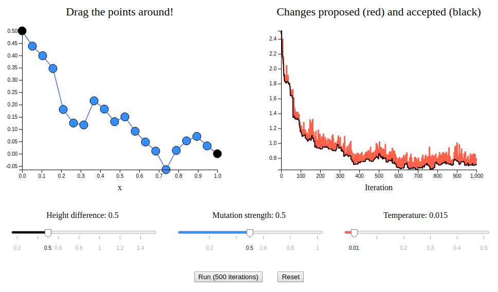

An interactive introduction to Simulated Annealing with d3.js
=========================================

Overview
-----------------------

In this project, I made two interactive demonstrations of Simulated Annealing, using the javascript d3.js library.The first demonstration lets you use it to solve the classic physics brachistochrone problem:

  

However, the problem may actually be convex, so it doesn't demonstrate the true ability of SA.

For this, the second demonstration shows the physical situation where the name actually came from: relaxing a 2D grid of spins (the Ising Model) to its lowest energy state:

An accompanying article, going into much more detail, can be found [on my blog here]().

Main run scripts
--------------------

These are the main `.py` scripts that I use, in the main directory for simplicity. They are:

* `SA_brach.html` - The brachistochrone simulation.
* `SA_ising.html` - The 2D Ising model simulation.

#
